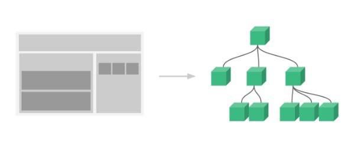
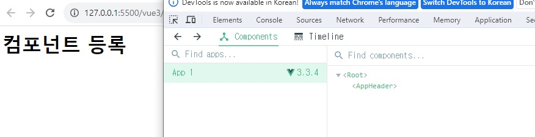
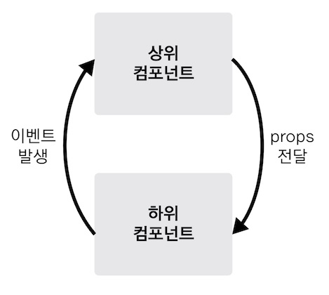
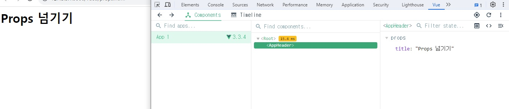
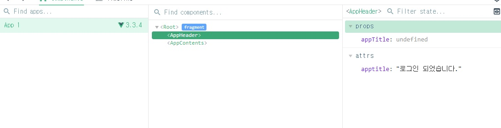

# 03. Vue.js 컴포넌트

## 03-01. Vue Component 소개

Vue와 React모두 컴포넌트 기반 라이브러리다.

**컴포넌트란 화면의 영역을 구분해서 개발할 수 있는 단위**

컴포넌트 기반으로 개발시 **유지보수에 효과적** -> 쉽게 기능을 개발하거나 변경할 수 있다.



좌측처럼 컴포넌트를 쪼갤때 마다 위에서 부터 트리 구조 형태로 컴포넌트가 하위의 컴포넌트와 연관성을 갖게 되는데 이 구조를 **컴포넌트 트리**라고 한다.


### 📘 참고

[Vue Component](https://joshua1988.github.io/vue-camp/vue/components.html)


## 03-02. Vue Component 등록과 표시

직접 등록하고 표시해보자.

인스턴스 옵션 속성에 components에 등록해주고, template에서 컴포넌트 이름을 태그로 작성하면 된다.

```html
<div id="app">
	<app-header></app-header>
</div>
<script src="https://unpkg.com/vue@3/dist/vue.global.js"></script>
<script>
  Vue.createApp({
    // instance 옵션 속성 - 옵션 API
    components: {
      // 객체 연결 
      // '컴포넌트 이름': 컴포넌트 내용
      'app-header': {
        template: '<h1>컴포넌트 등록</h1>'
      }
    }
  }).mount('#app');
</script>

```




## 03-03. Vue Component 통신 방식

최상위 루트 컴포넌트가 생성되고, Root아래에 AppHeader가 등록된 것을 확인해보았다.

화면의 영역간에 유기적으로 동작해야 하는 경우가 발생할 것이다. => 이때 컴포넌트 간에 어떤식으로 메세지를 주고 받을지 정의하는 것이 **컴포넌트 통신 방식**을 의미한다.



뷰에서는 **데이터는 항상 위에서 아래(props)**로 데이터가 흐르고, **아래에서 위로는 이벤트가 올라가는(emits**) 구조.

이때 이벤트는 마우스나 키보드 이벤트가 아니라 **컴포넌트 간의 메세지를 주고받기 위한 하나의 장치.**

즉, 하위에서 변경된 데이터를 받고 싶다면 위로 이벤트를 올려보내 이 데이터를 위에서 변경하여 아래로 다시 전달하는 방식


### 📘 참고

[Component Communication](https://joshua1988.github.io/vue-camp/vue/components-communication.html)


## 03-04. Vue Component Props

위에서 내려 줄 데이터를 받게 끔 props를  정의하고, 상위에서 데이터를 지정해서 내려보내면 된다.

```html
<div id="app">
  <app-header :title="appTitle"></app-header>
</div>
<script src="https://unpkg.com/vue@3/dist/vue.global.js"></script>
<script>
  Vue.createApp({
    data(){
      return{
        appTitle: 'Props 넘기기'
      }
    },
    components: {
      'app-header': {
        template:'<h1>{{title}}</h1>',
        props: ['title']
      }
    }
  }).mount('#app');
</script>

```

현재 app-header를 보면 props에 title이 정의된 것을 볼 수 있다.

data를 넘길때는 `v-bind:프롭스이름="상위컴포넌트의 데이터 이름"`로 넘기면 된다.



### 📘 참고

[Props](https://joshua1988.github.io/vue-camp/vue/props.html)


## 03-05. Event Emit 소개

> why?
>
> 아래에서 위로 데이터를 올릴 수 있으면 편하겠지만, 많은 컴포넌트들 간에 데이터가 한방향으로 흐르지 않고, N:N방향으로 흐르게 되면, **데이터 추적하기 어려워진다.**
>
> 그렇기 때문에 위에서 아래로 데이터를, 아래에서 위로는 이벤트를 올린다는 규칙이 생겼다.


갱신버튼을 클릭할때마다 refresh이벤트를 emit으로 발생시켜보자.

```html
<div id="app">
  <app-contents></app-contents>
</div>
<script src="https://unpkg.com/vue@3/dist/vue.global.js"></script>
<script>
  const appContents = {
    template: `
      <p>
        <button @click="sendEvent">갱신</button>  
      </p>
    `,
    methods: {
      sendEvent(){
        this.$emit('refresh');
      }
    }
  };


  Vue.createApp({
    data() {
      return {
        appTitle: "Props 넘기기",
      };
    },
    components: {
      "app-contents": appContents,
    },
  }).mount("#app");
</script>

```


### 📘 참고

[Event Emit](https://joshua1988.github.io/vue-camp/vue/event-emit.html)


## 03-06. Event Emit 구현

data를 받아 갱신시켜 보자.

아래와 같은 형태로 상위 컴포넌트에서 작성하면 된다.

```html
<컴포넌트 v-on:이벤트이름="상위 컴포넌트의 메서드 이름"></컴포넌트>
```

```html
<div id="app">
  <app-contents @refresh="showAlert"></app-contents>
</div>
<script src="https://unpkg.com/vue@3/dist/vue.global.js"></script>
<script>
  const appContents = {
    template: `
      <p>
        <button @click="sendEvent">갱신</button>  
      </p>
    `,
    methods: {
      sendEvent(){
        this.$emit('refresh');
      }
    }
  };

  // root component
  Vue.createApp({
    methods:{
      showAlert(){
        alert('refresh!')
      }
    },
    components: {
      "app-contents": appContents,
    },
  }).mount("#app");
</script>

```

보통 이벤트를 발생 시키는 이유는 상위의 데이터를 추가하거나 변경해달라는 목적 때문이다.


**❗ 다시한번 정리하자면, 컴포넌트는 항상 위에서 아래로는 데이터를, 아래에서 위로는 이벤트를 발생시켜 위의 데이터를 변경시킨다. 이렇게 데이터의 흐름을 제한하지 않으면 컴포넌트가 많아졌을 때 데이터가 어디서 수정되는지 추적이 어려워 지기 때문이다.**


## 03-07. 같은 레벨의 컴포넌트간 데이터 전달 방법

같은레벨에 직접 변경이 불가능하기 때문에 같은 부모를 통해서 통신을 해야한다.

```html
<div id="app">
  <app-header></app-header>
  <app-contents></app-contents>
</div>
<script src="https://unpkg.com/vue@3/dist/vue.global.js"></script>
<script>
  const appHeader = {
    data:(){
      appTitle: '로그인 하세요'
    },
    template: `
      <div>
        {{appTitle}}
      </div>
    `,
    methods: {
    }
  }
  const appContents = {
    template: `
      <p>
        <button>로그인</button>  
      </p>
    `,
    methods: {
    }
  };

  // root component
  Vue.createApp({
    components: {
      "app-header": appHeader,
      "app-contents": appContents,
    },
  }).mount("#app");
</script>

```

로그인 버튼을 누르면 appTitle이 로그인 되었습니다. 정도로 변경해보자.


```html
<div id="app">
  <app-header :appTitle="message"></app-header>
  <app-contents @login="changeMessage"></app-contents>
</div>
<script src="https://unpkg.com/vue@3/dist/vue.global.js"></script>
<script>
  const appHeader = {
    template: `
      <div>
        {{appTitle}}
      </div>
    `,
    props:['appTitle']
  }

  const appContents = {
    template: `
      <p>
        <button @click="sendEvent">로그인</button>  
      </p>
    `,
    methods: {
      sendEvent(){
        this.$emit('login');
      }
    }
  };

  // root component
  Vue.createApp({
    components: {
      "app-header": appHeader,
      "app-contents": appContents,
    },
    data(){
      return{
        message: '로그인하세요.'
      }
    },
    methods:{
      changeMessage(){
        this.message="로그인 되었습니다."
      }
    }
  }).mount("#app");
</script>
```


실행해보면 props와 attrs에 appTitle이 2개가 생긴걸 볼 수 있다.



html에서 태그는 대소문자 구분이 되있지 않기 때문에 props의 값이 제대로 인식이 되지않아 다 소문자로 취급되어 그렇다.

```html
<div id="app">
  <app-header :app-title="message"></app-header>
  <app-contents @login="changeMessage"></app-contents>
</div>
...
```

이처럼 `-`형태로 수정해주면되고, app-title이라 하였지만 js레벨에서는 appTitle과 같은 형태를 지니고 있다. 이는 Vue 내부적으로 정한 규칙이다. 

Vue파일로 작성하게 되면 상관없어진다.