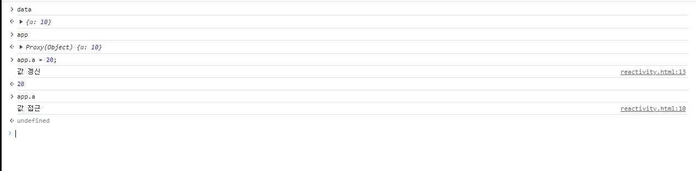
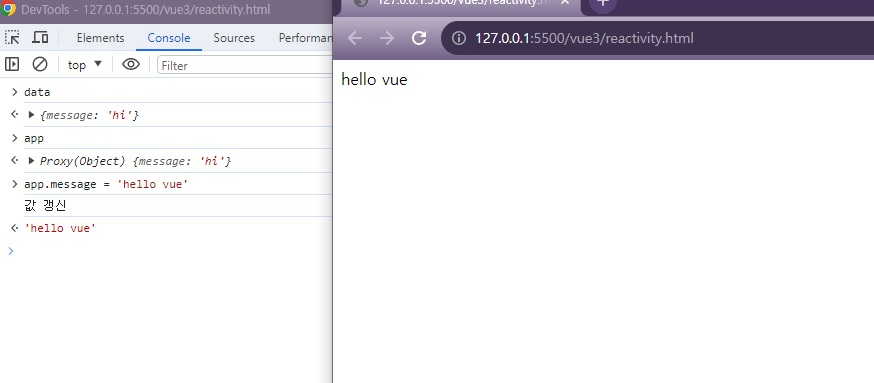
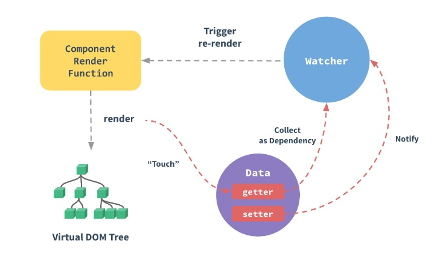

# 01. Vue.js 핵심 동작 원리

## 01-01. Vue3 Reactivity - Proxy 소개

message값을 변경하면 화면이 바로 바뀌는 것을 볼 수 있는데 Vue의 이런 동작이 어떻게 구현되는지 알아보자.

```html
// reactivity.html
<div id="app"></div>

<script>
  const data = {
    a: 10
  }
</script>
```

data의 값이 변했을 때 추가동작을 하도록 Javascript API를 사용해보자

```javascript
<div id="app"></div>

<script>
...
  new Proxy(data, {
    get(){
      console.log('hi')
    }
  })
</script>
```

Proxy의 첫번째 인자에 data를 두번째 인자에 동작을 정의 할 것이다.여기서 **get과 set**을 이용할 수 있다.

위의 경우 data객체의 동작에 proxy를 걸겠다고 하는 것인데 proxy를 걸겠다는 것은 **데이터의 동작을 모방하는 무언가를 만들겠다**는 의미.

```javascript
const app = new Proxy(data, {
    get(){
        console.log('hi')
    }
})
```

data라는 객체 프록시를 건 결과가 app이기 때문에 app에서 내용들은 처음엔 데이터와 같지만, app내용이 바뀌게 되면, data의 내용도 바뀌게 된다.


`new Proxy`라는 것이 결국에 data라는 객체를 모방한 다음에 동작을 추가했다는 것이고, a라는 속성을 접근하면 get이 동작하게 되고 a라는 속성을 새로 쓰거나 변경하면 set이 동작.

```javascript
<div id="app"></div>

<script>
  const data = {
    a: 10
  }

  const app = new Proxy(data, {
    get(){
      console.log('값 접근')
    },
    set(){
      console.log('값 갱신');
    }
  })
</script>
```



**❗ 정리하자면, Proxy는 객체를 모방하여 값에대한 변경과 접근싣 동작을을 정의할 수 있다.**


## 01-02. Vue3 Reactivity - 동작 원리 구현

공식 문서의 Proxy API를 보면, 기본 정의에 `Redefine fundamental operations for that object`라고 객체의 기본 동작을 재정의 할 수있다는 표현이 있다.

프록시를 이용해 Vue의 동작을 모방해보자.

set할 때 DOM API를 이용하여 APP에 접근해 innerHTML로 값을 넣어줄 것이다.<br/>(get과 set의 파라미터값은 공식문서에서 확인 가능.)

```html
<div id="app">
  <!-- rendering 될 메세지 -->
</div>

<script>
  const data = {
    message: 'hi'
  }

  function render(sth) {
    const div = document.querySelector('#app');
    div.innerHTML = sth;
  }

  const app = new Proxy(data, {
    get(target, property, receiver){
      console.log('값 접근')
    },
    set(target, property, value, receiver){
      console.log('값 갱신');
      target[property] = value; // 속성 값 변경
      render(value); // app에 message넣어 렌더링
    }
  })
</script>
```


message를 변경하면 화면의 값도 변경되는 것을 확인할 수 있다.

이것이 Vue에서 추구하는 리액티비티이다.




> Proxy의 Get과 Set 파라미터
>
> ```javascript
> new Proxy(target, {
>     get(target, property, receiver){ ... }
>     set(target, property, value, receiver){ ... }
> })
> ```
>
> **Get**
>
> * target : 대상 객체
> * property : 가져올 속성의 이름 또는 Symbol
> * receiver : 프록시 혹은 프록시에서 상속되는 객체.
>
> **Set**
>
> * target : 대상 객체
> * property : 가져올 속성의 이름 또는 Symbol
> * value : 설정할 속성의 새 값
> * receiver : 할당이 지시된 원래 객체. 일반적으로 프록시 자체.


**❗ Vue3에서는 프록시라는 API를 이용해 화면을 변경하고 있다는 걸 알면 된다.**

### 📘 참고

* [MDN Proxy](https://developer.mozilla.org/ko/docs/Web/JavaScript/Reference/Global_Objects/Proxy)
* [MDN DOM](https://developer.mozilla.org/ko/docs/Web/API/Document_Object_Model/Introduction)


## 01-03. Reactivity 차이점 - Vue2 & Vue3

Reactivity가 뭔지 알기 위해서는 Reactivity in Depth를 참고.



사진의 data부분이 위에서 프록시를 연결했던 부분으로 보면된다.

```html
<script src="https://unpkg.com/vue@3/dist/vue.global.js"></script>

<div id="app">{{ message }}</div>

<script>
  const { createApp, ref } = Vue

  createApp({
    setup() {
      const message = ref('Hello vue!')
      return {
        message
      }
    }
  }).mount('#app')
</script>
```

Vue.createApp의 data안에 값의 변경과 접근이 있을 때마다 내부적으로 UI를 갱신해준다던지, 별도의 computed API를 태운다던지 그런식의 연산을 시켜준다. 이 내부적인 동작은 vue에 위임하고, 우리는 데이터로 선언하고 그걸 가지고 화면을 개발하는 것.

❗ data가 setup되고 -> watcher를 통해서 compoent가 렌더되어 (component의 render function을 이용) -> Virtual DOM Tree로 화면에 UI가 그려진다.

> ❗ **기존 Vue2에서 리액티비티의 한계점 (Change Detection Caveats)**
>
> Vue2에 기반이 되는 Object.defineProperty에서 문제가 있었다.
>
> ```javascript
> const data = {a: ''}
> 
> Object.defineProperty(data, 'a', {
>     get(){...},
> 	set(){...}
> })
> ```
>
> defineProperty가 특정 속성에 대한 동작을 정의하는 것이기 때문에 **속성마다 모든 Define Proeprty의 API를 돌려야 헀다.**
>
> 즉, 미리 정의되지 않은 속성에 대해서는 리액티비티가 중비되지 않는 한계가 생겼다.
>
> Vue3에서는 Proxy는 객체를 통으로 모방하는 것이기 때문에 어떤 속성이 들어오던지 동일한 프록시의 동작으로 엮을 수 있게 되었다.


### 📘 참고

* [Vue2 - Reactivity In Depth](https://v2.vuejs.org/v2/guide/reactivity.html)
* [Vue3 - Reactivity 심화](https://vuejs.org/guide/extras/reactivity-in-depth.html#what-is-reactivity)

