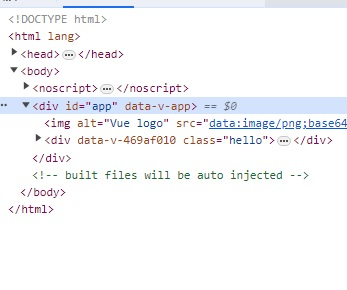
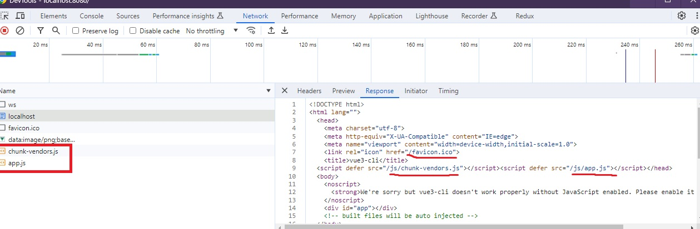

# 05. Vue CLI: 뷰 프로젝트 생성 도구

## 05-01. Vue CLI 소개 및 설치

`Vue CLI`는 Vue.js로 프로젝트를 시작할때 주로 사용하는 프로젝트 생성 도구 

CLI는 Command-Line Interface로 글자를 입력해 컴퓨터에 명령을 내리는 방식을 뜻한다.

<br/>

**Install**

```shell
npm install -g @vue/cli
or
yarn global add @vue/cli
```

**Create a project**

```shell
vue create 프로젝트명
```


## 05-02. Vue 프로젝트 생성 과정 설명 및 서버 실행

프로젝트 설치 후 해당 폴더로 이동해 실행하면된다.

yarn이든 npm이던 js패키지, 라이브러리를 로컬에 설치가히 위한 도구이고, 프로젝트 관련된 명령어를 모아놓고 실행할 수 있다. (package.json)

```shell
npm run serve
or 
yarn serve
```

실행 후 localhost:8080으로 들어가 확인할 수 있다.


## 05-03. Vue 프로젝트 폴더 내용 살펴보기

### **package.json**

package.json에서 이름 버전, private 설정, script 태그 명령어, 사용 라이브러리 등을  확인할 수 있다.

```json
{
  "name": "vue3-cli",
  "version": "0.1.0",
  "private": true,
  "scripts": {
    "serve": "vue-cli-service serve",
    "build": "vue-cli-service build",
    "lint": "vue-cli-service lint"
  },
  "dependencies": {
    "core-js": "^3.8.3",
    "vue": "^3.2.13"
  },
  "devDependencies": {
    "@babel/core": "^7.12.16",
    "@babel/eslint-parser": "^7.12.16",
    "@vue/cli-plugin-babel": "~5.0.0",
    "@vue/cli-plugin-eslint": "~5.0.0",
    "@vue/cli-service": "~5.0.0",
    "eslint": "^7.32.0",
    "eslint-plugin-vue": "^8.0.3"
  },
  "eslintConfig": {
    "root": true,
    "env": {
      "node": true
    },
    "extends": [
      "plugin:vue/vue3-essential",
      "eslint:recommended"
    ],
    "parserOptions": {
      "parser": "@babel/eslint-parser"
    },
    "rules": {}
  },
  "browserslist": [
    "> 1%",
    "last 2 versions",
    "not dead",
    "not ie 11"
  ]
}
```


### **vue.config.js**

웹팩의 설정을 바꾼다거나 추가적으로 제공하는 설정 내용을 수정하려 할떄 이곳에 작성.

```js
const { defineConfig } = require('@vue/cli-service')
module.exports = defineConfig({
  transpileDependencies: true
})
```


### **public폴더의 index.html**

화면에 표시될 껍데기.

```html
<!DOCTYPE html>
<html lang="">
  <head>
    <meta charset="utf-8">
    <meta http-equiv="X-UA-Compatible" content="IE=edge">
    <meta name="viewport" content="width=device-width,initial-scale=1.0">
    <link rel="icon" href="<%= BASE_URL %>favicon.ico">
    <title><%= htmlWebpackPlugin.options.title %></title>
  </head>
  <body>
    <noscript>
      <strong>We're sorry but <%= htmlWebpackPlugin.options.title %> doesn't work properly without JavaScript enabled. Please enable it to continue.</strong>
    </noscript>
    <div id="app"></div>
    <!-- built files will be auto injected -->
  </body>
</html>

```

실제로 `<div id="app" />`만 있는 걸 볼 수 있다.

이전까지는 `Vue.createApp({ ... })mount('#app')`으로 app에 빌드된 결과물(번들)이 최종적으로 들어갔었다.

index.html이 바로 이 애플리케이션의 진입점이 된다고 보면된다.

`#app`안에 Vue CLI 로 빌드된 결과물이 들어가게 될 것이다.


### **main.js**

기존에 HTML에서 작성한 `createApp().mount()`가 설정되있는 걸 볼 수 있다.

```javascript
import { createApp } from 'vue'
import App from './App.vue'

createApp(App).mount('#app')
```


### 📘 참고

[dependency와 devDependency 차이](https://joshua1988.github.io/webpack-guide/build/npm-module-install.html#개발용-라이브러리와-배포용-라이브러리-구분하기)

[ESLint와 프리티어 소개](https://joshua1988.github.io/web-development/vuejs/boost-productivity/)

[VueCLI API 문서](https://cli.vuejs.org/config/#vue-config-js)


## 05-04. 라이브러리, 파일 임포트 방식 설명

```javascript
import { createApp } from 'vue'
```

from 뒤에 오는 것이 라이브러리로 package.json의 dependecies에 있는 내용과 동일 하다.

즉 위구문은 vue라는 라이브러리 안에서 createApp을 가져온 것이다.<br/>이전 cdn링크를 클릭해보면 code를 확인해볼 수 있는데 이런 코드들을 vue create할 때 같이 설치했다.


import는 라이브러리 뿐만아니라 파일도 가져올 수 있다.

```javascript
import App from './App.vue'
```

해당 파일(App.vue)을 App으로 가져온 것이다.


이처럼 별도의 파일에다가 코드를 작성하고 그 파일을 임포트로 들고 와서 하는 것들이 모듈이란 개념이다.

관심사 별로 여러개 파일들에서 필요할때 가져다 쓰겠다는 것이다.

### 📘 참고

[Import문법 안내 문서](https://joshua1988.github.io/vue-camp/es6+/modules.html#모듈화의-필요성)


## 05-05. 페이지 로딩 과정 분석

localhost:8080으로가서 개발자도구로 확인해보면, `<div id="app"></div>`안에 내용이 들어 간 것을 볼 수 있다.




내용들이 어떻게 온 건지 살펴보자.

head태그 안에 `chunk-vendors.js`와 `app.js`파일 2개가 추가된 것을 볼 수 있다.

개발자 도구의 Network패널을 보면 어떤 리소스들을 가져오는 지 순서대로 확인할 수 있다.



localhost에서 가져온 내용을 보면 먼저 `favicon.ico`를 부르고 그다음 `chunk-vendors.js`, `app.js`를 차례차례 부르는 것을 확인할 수 있다.


### 📘 참고

[Vue Loader](https://vue-loader.vuejs.org/)

[Loader란?](https://joshua1988.github.io/webpack-guide/concepts/loader.html)

[웹팩이란?](https://joshua1988.github.io/webpack-guide/webpack/what-is-webpack.html)